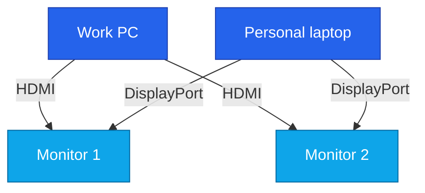
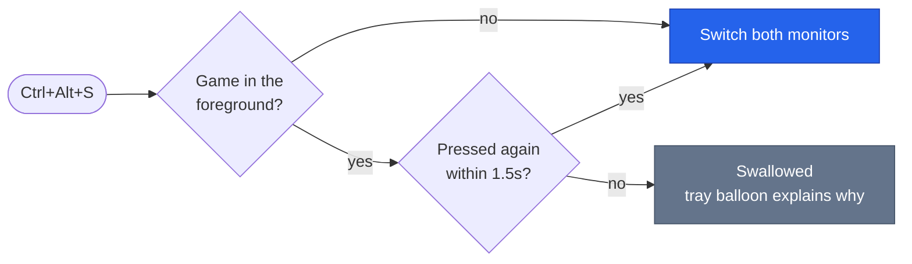

<div align="center">


# ScreenSwitch

**One keypress moves both monitors between your work computer and your personal one.**

No reaching behind the desk. No cycling through the monitor's OSD buttons.

[](https://github.com/adirangel/switch/actions/workflows/build.yml)


</div>

---

## How it works

Modern monitors support **DDC/CI**, a control protocol that rides on the video cable itself and
accepts exactly the same commands the physical OSD buttons issue. The relevant one is VCP feature
`0x60`, *Input Select*; writing to it changes the active input.

Both monitors are wired to both machines at once — one input per computer:



So the practical consequence is this: **the computer you are sitting at is the one that pushes the
monitors over to the other machine.** That is why the app goes on both — each configured to send the
displays to the *other* one:

| Machine | Connected via | Target configured on it | Pressing the hotkey there |
|---|---|---|---|
| Work PC | HDMI | `DisplayPort1` | Monitors jump to the personal laptop |
| Personal laptop | DisplayPort | `HDMI1` (or `HDMI2`) | Monitors jump to the work PC |

---

## Installation

### 1 · Get the executable

Open the **Actions** tab, pick the most recent `build` run, and download the `ScreenSwitch-win-x64`
artifact. Inside is a single `ScreenSwitch.exe` — self-contained, no .NET install required, no
administrator rights required. Put it somewhere permanent, such as `C:\Tools\ScreenSwitch\`.

> [!NOTE]
> Windows will almost certainly show a **SmartScreen** warning the first time — *"Windows protected
> your PC"*. That is a reputation prompt, not a virus detection: the file is unsigned and brand new.
> Click **More info → Run anyway**, or right-click the downloaded ZIP → Properties → tick
> **Unblock** before extracting, which avoids the prompt entirely.

Prefer to build it yourself:

```powershell
dotnet publish src/ScreenSwitch/ScreenSwitch.csproj -c Release -r win-x64 -o publish
```

### 2 · First run, on **each** of the two machines

1. Confirm DDC/CI is enabled on both monitors: OSD → **System Setup** → **DDC/CI** → **On**.
   It usually is by default.
2. Run `ScreenSwitch.exe`. A blue icon with arrows appears in the tray.
3. Right-click → **Monitor details…** to see what was detected, which input each monitor is on, and
   which inputs it supports. This is also how you learn whether the work PC sits on `HDMI1` or
   `HDMI2`.
4. Right-click → **Switch to** → pick the input belonging to the **other** computer. That first
   choice is saved as the standing target, and from then on `Ctrl+Alt+S` works.
5. Answer **yes** when asked about starting with Windows.

Then repeat on the second machine, targeting the first machine's input.

> [!TIP]
> The tray interface is in Hebrew. Menu items appear below in English with the Hebrew label
> alongside: **Monitor details…** (פרטי מסכים…), **Switch to** (עבור אל), **Start with Windows**
> (הפעל עם Windows).

### 3 · Auto-start

The first-run prompt covers it. To change your mind later, toggle **Start with Windows** in the tray
menu, or use the command line:

```powershell
ScreenSwitch.exe --autostart on
ScreenSwitch.exe --autostart off
ScreenSwitch.exe --autostart        # report current state
```

This writes one value under `HKCU\Software\Microsoft\Windows\CurrentVersion\Run` — per-user, so it
never needs administrator rights. Once enabled it shows up as **ScreenSwitch** in Task Manager →
Startup.

> [!IMPORTANT]
> The first-run prompt only appears when no target is configured yet. If you are upgrading from an
> earlier build you already have a config, so use the menu toggle or `--autostart on` instead.

---

## Daily use

| Action | What happens |
|---|---|
| `Ctrl+Alt+S` | Both monitors go to the other computer |
| Double-click the tray icon | The same thing |
| Right-click the tray icon | Full menu: one-off switch, change the standing target, re-detect monitors |

---

## Gaming: not switching mid-match

A global hotkey fires wherever you are, and losing both displays during a teamfight is a bad time to
discover that. So while a game is in the foreground the first press is swallowed; press again within
1.5 seconds and it goes through.



**This works for any game, with nothing to configure.** Detection is behavioural — it asks what the
foreground application is *doing*, never which application it is — so a title released long after
this code was written is covered on the same terms as anything else. Three signals, covering the
three ways games actually run:

| Signal | Catches |
|---|---|
| Windows reports an exclusive full-screen Direct3D app | Classic full-screen games |
| The foreground window covers an entire monitor | Borderless windowed, how most modern games run |
| The cursor is confined to less than the whole desktop | Games running in a genuine window, which lock the mouse |

For the rare game that runs windowed *and* leaves the cursor free, `blockedProcesses` takes process
names. It ships empty — the signals above are expected to do the work — and is matched
case-insensitively, with or without the `.exe`:

```jsonc
"blockedProcesses": ["SomeGame", "AnotherGame.exe"]
```

The guard applies to the hotkey only. The tray menu, a double-click on the icon and the command line
all switch unconditionally — reaching any of them means you already left the game. Alt-tabbing out or
minimising drops the guard too, so the hotkey behaves normally the moment you are back on the
desktop. Set `"blockWhileGaming": false` to turn the whole thing off.

> [!NOTE]
> While ScreenSwitch is running, Windows delivers `Ctrl+Alt+S` to it and to nothing else — the
> combination is invisible to every other application, games included. If you ever want that chord
> inside a game, change `hotkey` to something a game will never use, such as `Ctrl+Alt+F12`.

---

## Command line

Useful for diagnostics, and for binding the switch to a Stream Deck or anything else that can run a
file:

| Command | Does |
|---|---|
| `ScreenSwitch.exe --list` | What is connected, current input, supported inputs |
| `ScreenSwitch.exe --switch` | Switch to the target from the config file |
| `ScreenSwitch.exe --to HDMI2` | Switch to a specific input |
| `ScreenSwitch.exe --autostart on` | Start with Windows |

---

## Configuration

Stored at `%APPDATA%\ScreenSwitch\config.json`, openable straight from the tray menu. Every field is
optional:

```jsonc
{
  "targetInput": "DisplayPort1",   // where the monitors go from this machine
  "hotkey": "Ctrl+Alt+S",          // Ctrl/Alt/Shift/Win + letter, digit or F1-F24
  "delayBetweenMonitorsMs": 150,   // pause between one monitor and the next
  "showNotifications": true,       // tray balloons
  "retryCount": 1,                 // retries for a monitor that did not respond
  "blockWhileGaming": true,        // swallow the first press while a game is in front
  "blockedProcesses": [],         // extra process names that always count as a game
  "overrideWindowMs": 1500,        // how long a second press counts as "I meant it"; 0 disables
  "monitorTargets": {              // a different target for one specific monitor
    "\\\\?\\DISPLAY#ACI27E7#5&...": "HDMI2"
  }
}
```

`targetInput` accepts names (`HDMI1`, `HDMI 2`, `DisplayPort1`), aliases (`DP`, `HDMI`) or a raw
value (`0x11`). `monitorTargets` is only needed when the two monitors are wired to different ports —
one on HDMI 1 and the other on HDMI 2, say. Names in `blockedProcesses` and keys in `monitorTargets`
are both matched case-insensitively, and process names work with or without the `.exe`.

---

## Troubleshooting

<details>
<summary><strong>"The monitor did not respond to the DDC/CI command"</strong></summary>

Nearly always DDC/CI switched off in the OSD. Check **System Setup → DDC/CI → On** on each monitor
separately — they are configured independently.

</details>

<details>
<summary><strong>One monitor switches, the other does not</strong></summary>

Run `--list` and check that both are detected. If the second does not appear at all, try another
cable or port. If it appears but fails, raise `retryCount` to 2 and `delayBetweenMonitorsMs` to 300.

</details>

<details>
<summary><strong>It switches, but to the wrong port</strong></summary>

The two monitors are on different ports. Use `monitorTargets` to give one of them its own target.

</details>

<details>
<summary><strong>The hotkey does nothing</strong></summary>

Either another application already owns the combination — a balloon says so at startup, so change
`hotkey` in the config and restart — or a game is in the foreground and the guard swallowed the
press. Press again within 1.5 seconds, or read the balloon.

</details>

<details>
<summary><strong>It does not start with Windows despite the tick</strong></summary>

Disabling the entry in Task Manager → Startup writes a separate flag that overrides the Run key. The
tray menu only reads the Run key, so it still shows ticked. Re-enable it in Task Manager.

</details>

<details>
<summary><strong>Connected through a dock or USB-C</strong></summary>

DDC usually passes through docks, but not always. If the monitors are not detected through the dock,
connect DisplayPort straight to the laptop.

</details>

<details>
<summary><strong>The monitors switched and now I cannot switch back</strong></summary>

Press `Ctrl+Alt+S` on the other computer. If something has gone badly wrong, the monitor's own
buttons always still work.

</details>

---

## Project layout

| Path | Role |
|---|---|
| `src/ScreenSwitch.Core/` | Platform-neutral logic: capabilities parsing, config, hotkeys, the gaming guard |
| `src/ScreenSwitch/` | The tray app: WinForms, P/Invoke to `dxva2.dll`, command line |
| `tests/ScreenSwitch.Tests/` | Unit tests over `ScreenSwitch.Core` |
| `tools/make_icon.py` | Regenerates `Resources/app.ico` |
| `docs/logo.svg` | The mark above, matching the tray icon |
